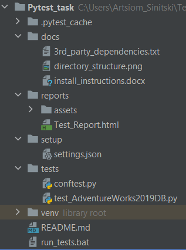

# Pytest Homework Solution


## Table of Contents
1. [Introduction](README.md#introduction)
2. [Data sources](README.md#data-sources)
3. [Project structure](README.md#project-folder-structure)
4. [Installation requirements](README.md#installation-requirements)
5. [Infrastructure setup](README.md#infrastructure-setup)
6. [Running tests](README.md#running-tests)
7. [Author](README.md#author)

## Introduction
This project's aim is to explore Pytest - an open source testing framework based on Python. For more information on Pytest click [here](https://docs.pytest.org/en/7.1.x/index.html).


## Data Sources
The [AdventureWorks2019](https://docs.microsoft.com/en-us/sql/samples/adventureworks-install-configure?view=sql-server-ver15&tabs=ssms) dataset was used for testing purposes.


## Installation Requirements
Programming Languages:
* Python 3.9+

Third-Party Dependencies:
* Libraries required - see the [Dependencies List](docs/3rd_party_dependencies.txt)


## Project Folder Structure

* /docs - media resources and text for the README file sections
* /logs - log files and reports with dataset test results
* /setup - settings for connecting to databases, etc.
* /tests - test cases implementation
* README.md - project's detailed description
* run_tests.bat - entry point to begin tests execution


## Infrastructure setup
* MS Windows 10
* MS SQL Server 2019 - RDBMS for hosting the dataset to be tested
* Pycharm 2022.1 (Community Edition) - Python IDE to develop Pytest tests
* Refer to the [Installation Instructions](docs/install_instructions.docx) for more details


## Running tests
##### From the project's root folder run the following:
```cmd.exe
run_tests.bat
```


## Author
Artsiom Sinitski